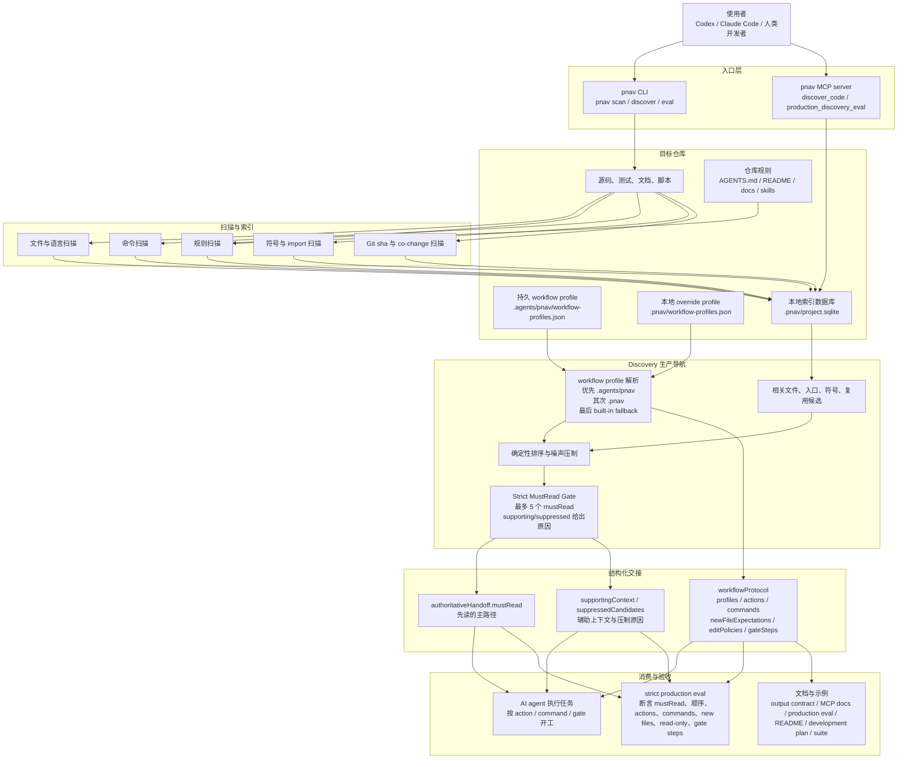
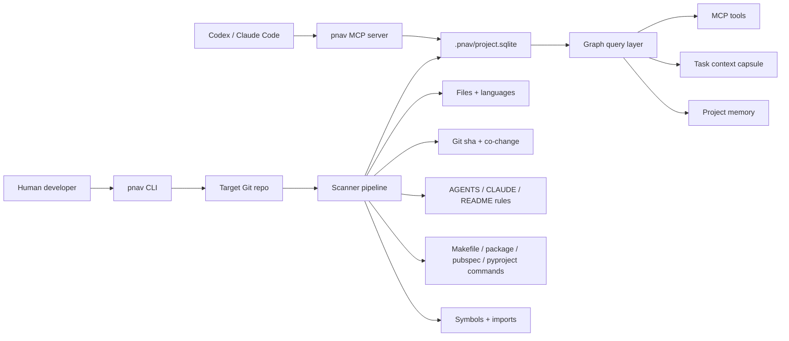
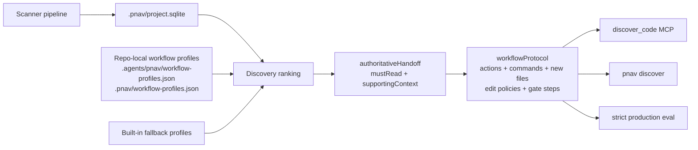
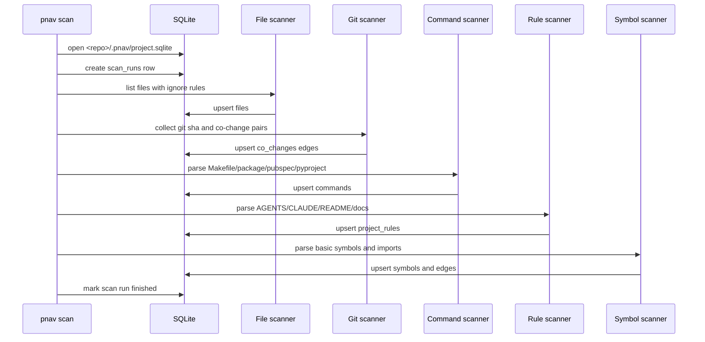

# Architecture

## 中文架构总览

本次同步范围：在《架构文档》中补充 Mermaid 架构图，并同步更新《输出契约》、
《MCP 工具文档》、《生产评测文档》、《README》、《开发计划》和示例评测套件。



关键约束：

- `mustRead` 和 `supportingContext` 只接收目标仓库中已经存在的文件。
- 未来文件、证据目录、migration pair、临时反例记录放入 `newFileExpectations`。
- generated SDK 等生成物通过 `editPolicies` 标记为 `read_only`，由推荐命令生成。
- strict eval 不只检查平均分，也检查读文件顺序、warning、action、command、new file、
  read-only policy、gate step 和 profile source。

ProjectNavigatorMCP has two responsibilities:

1. Provide a globally installable CLI and MCP server named `pnav`.
2. Maintain a project-local repository intelligence database inside each target repository.

The target repository's business database is not used. ProjectNavigatorMCP stores its own
analysis data in:

```text
<target-repo>/.pnav/project.sqlite
```

## Architecture Summary



## Discovery Workflow Protocol



Workflow profiles are resolved from the target repository before built-in fallbacks. Existing
files may enter `mustRead` and `supportingContext`; future artifacts such as evidence
directories, migration pairs, and counterexample notes belong in `newFileExpectations`.

## Runtime Modes

### CLI Mode

Used by humans, scripts, and acceptance tests.

```bash
pnav doctor
pnav init <repo>
pnav scan <repo>
pnav map <repo>
pnav capsule <repo> "<task>"
pnav mcp <repo>
```

### MCP Mode

Used by Codex, Claude Code, or other MCP clients.

```bash
pnav mcp <repo>
```

The MCP server opens:

```text
<repo>/.pnav/project.sqlite
```

and exposes repository intelligence tools.

The MCP server should not rescan the whole repository automatically on every tool call.
Scanning belongs to `pnav scan <repo>` or to a future explicit `refresh_index` tool.

## Storage Model

SQLite is the MVP storage engine.

It stores:

- repository metadata
- scan runs
- files
- symbols
- graph edges
- commands
- project rules
- memories
- tasks

SQLite is chosen because it is local, portable, inspectable, and requires no daemon.

Postgres is a future option only when one of these becomes necessary:

- team-shared project memory
- web dashboard
- multi-project analytics
- permissions and audit logs
- SaaS deployment

## Graph Model

Use a generic `edges` table:

```text
from node -> edge kind -> to node
```

Initial node types:

- `file`
- `symbol`
- `command`
- `rule`
- `memory`
- `task`

Initial edge kinds:

- `contains`: file contains symbol
- `imports`: file imports file
- `references`: file or symbol references another symbol
- `routes_to`: route maps to page or handler
- `covered_by`: source file likely covered by test file
- `co_changes`: files often change together in Git history
- `mentions`: document/rule/memory mentions file, symbol, or command

MVP can delay precise `calls` edges. It is better to ship a reliable partial graph than a
fragile call graph.

## Query Strategy

Avoid plain BFS as the main product behavior. Use weighted retrieval:

```text
score = path match + symbol match + rule match + command match + test relation + git co-change + memory match
```

The first version can be simple and deterministic. Later versions can add Tree-sitter,
LSP, SCIP, embeddings, or runtime traces.

## Scanner Pipeline



## Context Capsule

The context capsule is the main product output. It turns repository intelligence into a
small handoff document for a coding agent.

It should include:

- task interpretation
- likely files
- entry points
- related symbols
- impact risks
- recommended tests and commands
- project rules
- memory hits
- suggested next steps

For production Discovery Mode, the context capsule should prefer `authoritativeHandoff`: a
strict handoff with capped `mustRead`, route-to-widget chain completeness, precise
suppression reasons, reuse affected callers, and test coverage evidence. Strict eval should
treat forbidden mustRead files, missing suppression reasons, over-budget mustRead, and
insufficient chain completeness as hard failures instead of relying only on weighted score.

## Future Enhancements

Add these only after MVP works end-to-end:

1. Tree-sitter collectors for more accurate symbols and imports.
2. Dart `analysis_server`, Pyright, or TypeScript language service for exact references.
3. SCIP import for precomputed code navigation indexes.
4. Background incremental scan based on Git status or a file watcher.
5. Postgres sync for team-shared memory.
6. Optional embeddings for fuzzy memory and task search.
