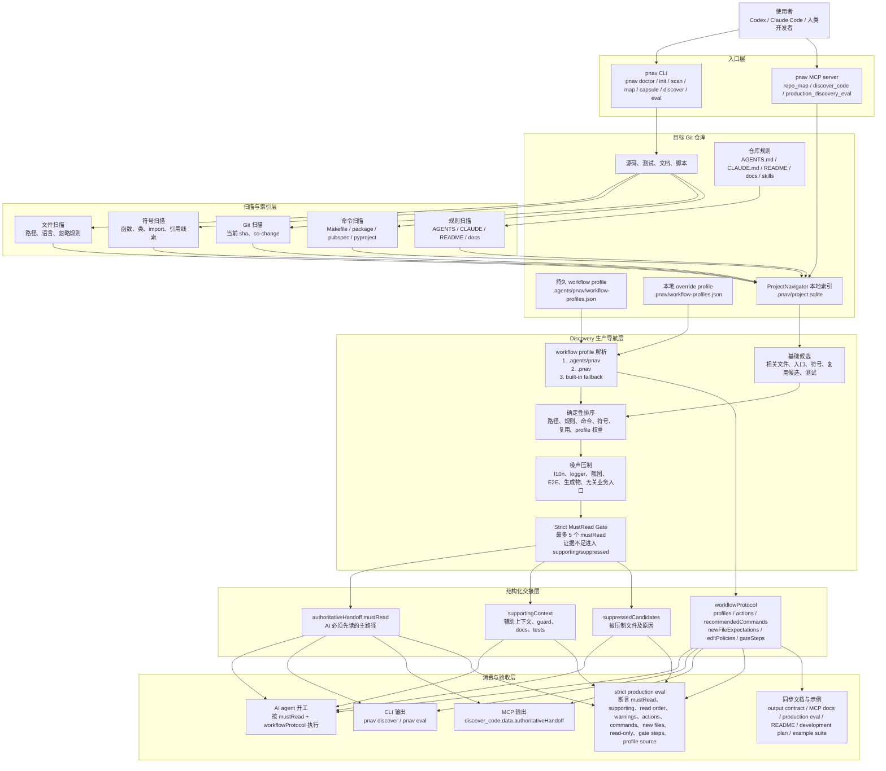

# 架构

## 架构总览



ProjectNavigatorMCP 的目标是成为本地优先的 Repository Intelligence MCP。它扫描目标 Git
仓库，把项目索引写入目标仓库自己的 `.pnav/project.sqlite`，然后通过 CLI 和 MCP 工具给
Codex、Claude Code 或人类开发者提供任务导航、影响分析、测试推荐和项目记忆。

目标仓库的业务数据库不会被 ProjectNavigatorMCP 使用。所有代码地图、索引和评测记录都
属于 ProjectNavigatorMCP 自己的本地数据：

```text
<target-repo>/.pnav/project.sqlite
```

## Workflow Protocol

`discover_code.data.authoritativeHandoff` 是生产级 Discovery Mode 的主输出。AI agent
应该先看 `authoritativeHandoff.mustRead`，再根据 `workflowProtocol` 决定本轮要执行
哪些动作、命令、证据产物和门禁。

workflow profile 的读取顺序是：

1. `.agents/pnav/workflow-profiles.json`
2. `.pnav/workflow-profiles.json`
3. 内置 fallback profile

其中 `.agents/pnav` 是推荐的持久配置位置，`.pnav` 只适合本地 override。内置 profile
用于目标仓库尚未配置 profile 时避免能力倒退。

profile 可以描述：

- `match`：任务匹配规则。
- `mustRead`：必须先读的核心文件，只允许已经存在的文件进入。
- `supporting`：辅助上下文，只允许已经存在的文件进入。
- `suppressPaths`：需要压制的噪声路径。
- `warnings`：必须提示给 agent 的工作流约束。
- `actions`：结构化施工动作，例如 `create_openapi_operation`、`create_migration_pair`。
- `recommendedCommands`：推荐或必跑命令，例如 `sdk:generate`、`sdk:check`。
- `newFileExpectations`：未来文件、证据目录、migration pair、临时反例记录。
- `editPolicies`：编辑策略，例如 generated SDK 标记为 `read_only`。
- `gateSteps`：验收步骤，例如 guard、schema drift、Appium acceptance。

关键约束：

- `mustRead` 和 `supportingContext` 只接收目标仓库中已经存在的文件。
- 未来文件、证据目录、migration pair、临时反例记录放入 `newFileExpectations`。
- generated SDK 等生成物通过 `editPolicies` 标记为 `read_only`，由推荐命令生成。
- strict eval 不只检查平均分，也检查读文件顺序、warning、action、command、new file、
  read-only policy、gate step 和 profile source。

## 运行模式

### CLI 模式

CLI 面向人类、脚本和验收测试：

```bash
pnav doctor
pnav init <repo>
pnav scan <repo>
pnav map <repo>
pnav capsule <repo> "<task>"
pnav mcp <repo>
```

### MCP 模式

MCP 面向 Codex、Claude Code 或其他 MCP client：

```bash
pnav mcp <repo>
```

MCP server 会打开：

```text
<repo>/.pnav/project.sqlite
```

并暴露 repository intelligence 工具。MCP 工具调用不会默认重新扫描整个仓库；扫描应由
`pnav scan <repo>` 或未来显式的 refresh 工具触发。

## 存储模型

MVP 使用 SQLite。

SQLite 存储：

- 仓库元数据
- 扫描记录
- 文件
- 符号
- 图边
- 命令
- 项目规则
- 记忆
- 任务

选择 SQLite 是因为它本地优先、可移植、可检查、不需要守护进程。Postgres 只作为未来选项，
例如团队共享记忆、Web dashboard、多项目分析、权限审计或 SaaS 部署。

## 图模型

核心图模型使用通用 `edges` 表：

```text
from node -> edge kind -> to node
```

初始节点类型：

- `file`
- `symbol`
- `command`
- `rule`
- `memory`
- `task`

初始边类型：

- `contains`：文件包含符号。
- `imports`：文件 import 另一个文件。
- `references`：文件或符号引用另一个符号。
- `routes_to`：路由映射到页面或 handler。
- `covered_by`：源文件可能被测试文件覆盖。
- `co_changes`：Git 历史中经常一起变更的文件。
- `mentions`：文档、规则或记忆提到文件、符号或命令。

MVP 可以延后精确 `calls` 边。可靠的局部图比脆弱的完整 call graph 更重要。

## 查询策略

主产品行为不使用普通 BFS，而是使用加权检索：

```text
score = path match + symbol match + rule match + command match + test relation + git co-change + memory match
```

第一版保持确定性和可解释。后续可以增加 Tree-sitter、LSP、SCIP、embeddings 或运行时 trace。

## Context Capsule

context capsule 是面向 coding agent 的任务上下文包。

它应该包含：

- 任务解释
- 可能相关文件
- 入口点
- 相关符号
- 影响风险
- 推荐测试和命令
- 项目规则
- 记忆命中
- 建议下一步

生产级 Discovery Mode 中，context capsule 应优先使用 `authoritativeHandoff`。它提供严格
的 `mustRead`、route-to-widget 链路完整度、精确 suppression reason、复用影响调用方和
测试覆盖证据。strict eval 应把 forbidden mustRead、suppression reason 缺失、mustRead
超预算、链路完整度不足、workflow action 缺失等作为 hard failure。
